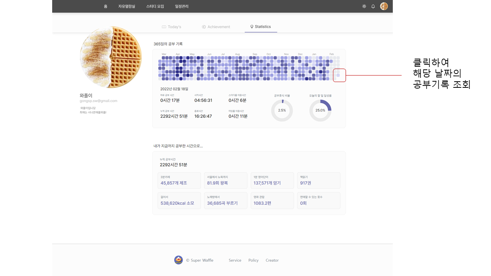
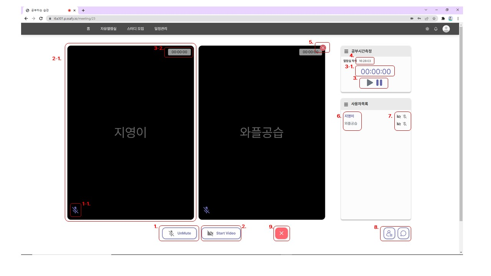
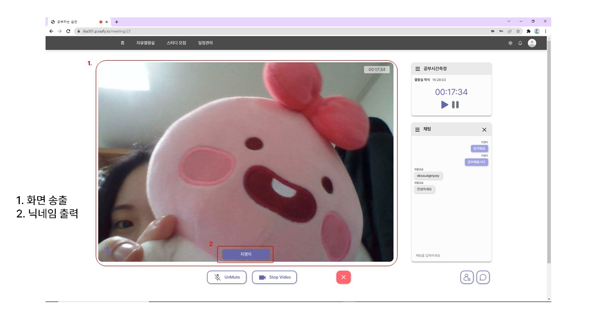
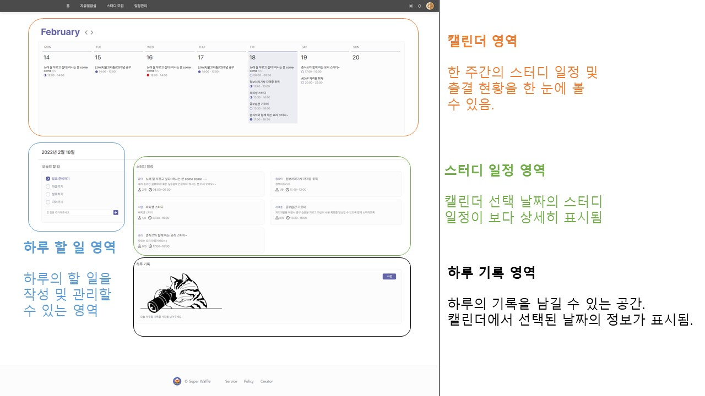
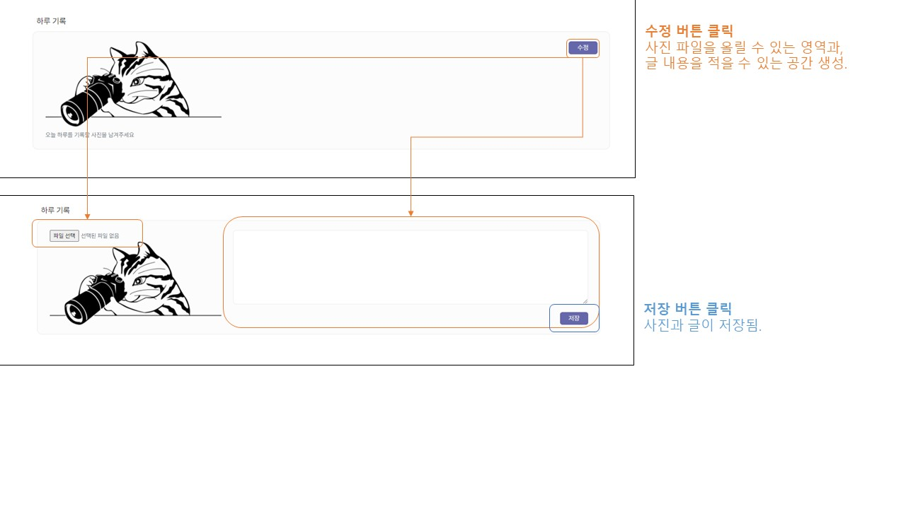
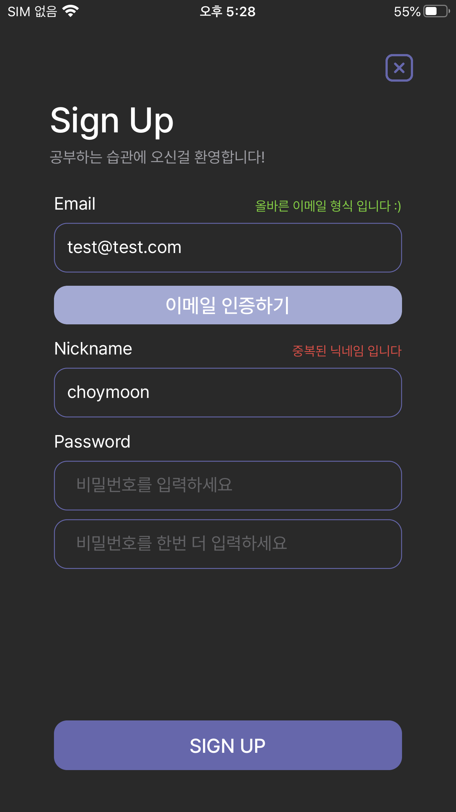
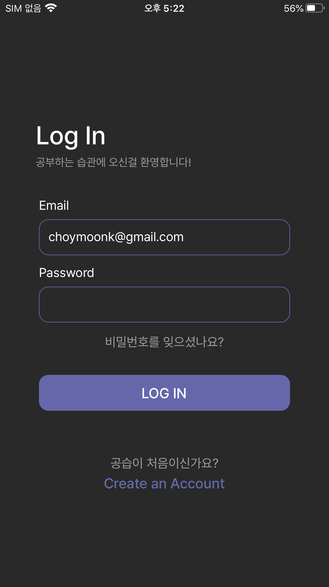
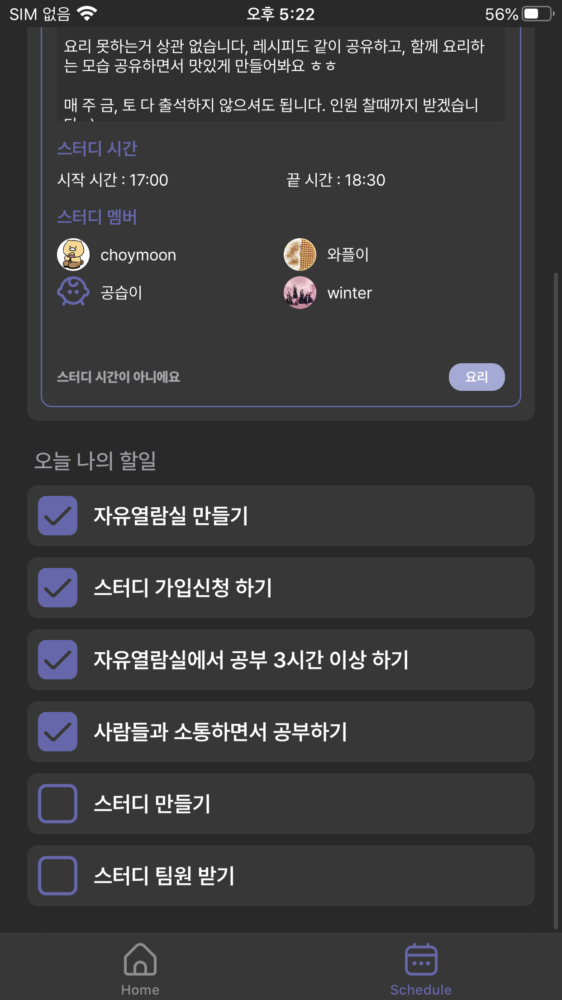

# 시연 시나리오

## 1. 홈

 

### **메인 탭**

### **업적 탭**

### **통계 탭**

---

 

## 2. 자유열람실

 

### **자유열람실 목록**

### **자유열람실 상세페이지**

### **자유열람실 내부**

---

 

## 3. 스터디 모집

 

---

 

## 4. 일정관리

 

---

 

## 5. 관리 페이지

 

---

 

## 6. 앱

 

### **회원가입**

### **로그인**

### **메인**

### **스터디 목록**

### **투두리스트**

